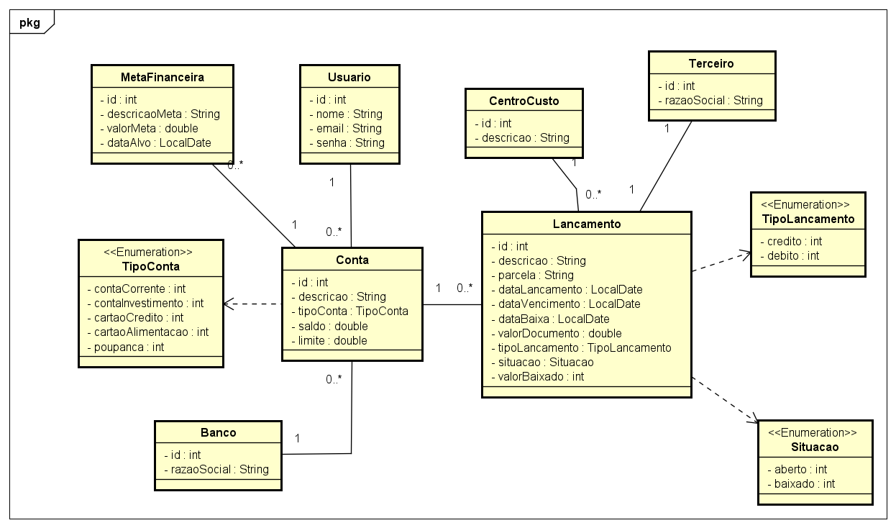

# 📊 Projeto Financeiro

O **Projeto Financeiro** é uma aplicação voltada para a **gestão das finanças pessoais**, ajudando o usuário a organizar melhor seu dinheiro e planejar o futuro.  

Com ele, é possível **controlar contas bancárias, registrar receitas e despesas, acompanhar o saldo em tempo real e definir metas financeiras** — como guardar dinheiro para uma viagem, comprar um bem ou simplesmente manter um controle mais saudável das finanças.

---

## 🫡 Diagrama de Classe

## ✨ Principais funcionalidades
- **Cadastro de contas**: registre diferentes contas bancárias ou carteiras e acompanhe os saldos individualmente.
- **Controle de lançamentos**: registre entradas (receitas) e saídas (despesas) para ter uma visão clara do fluxo financeiro.
- **Metas financeiras**: defina objetivos, como economizar um valor até uma data específica, e acompanhe o progresso.
- **Relatórios e acompanhamento**: visualize informações consolidadas para entender melhor onde o dinheiro está sendo gasto.
- **Segurança com login**: apenas usuários cadastrados podem acessar seus dados, garantindo privacidade e proteção.
- **Interface via API**: todas as operações podem ser realizadas por meio de chamadas simples e organizadas.

---

## 🎯 Objetivo do sistema
O projeto busca ajudar **pessoas que desejam ter maior controle sobre suas finanças**, oferecendo uma solução digital prática e acessível.  
Ele pode ser usado tanto por usuários comuns quanto como base de estudo para quem está aprendendo **desenvolvimento de sistemas financeiros em Java**.

---

## 🚀 Como usar
1. **Crie sua conta de usuário** para ter acesso ao sistema.  
2. **Cadastre suas contas** (ex.: Conta Corrente, Poupança, Carteira).  
3. **Adicione lançamentos financeiros** (ex.: salário recebido, conta de energia, compras, etc.).  
4. **Defina suas metas** (ex.: juntar R$ 8.000 até dezembro para uma viagem).  
5. **Acompanhe o progresso** e veja se está gastando mais do que deveria ou conseguindo economizar.  

---

## 👤 Público-alvo
- Pessoas físicas que desejam organizar melhor suas finanças pessoais.  
- Estudantes e desenvolvedores que queiram entender a implementação de um sistema financeiro com **Java + Spring Boot**.  

---

## 📌 Benefícios
- Clareza sobre receitas e despesas.  
- Auxílio no planejamento financeiro.  
- Apoio no cumprimento de metas pessoais.  
- Base para estudos em desenvolvimento de aplicações web modernas.  

## 🫡 Autores
- Ana Carolina Dumont Franco
- Leonardo Henrique Costa
